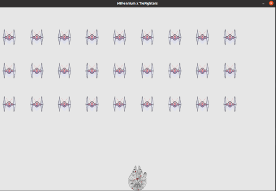

# Star Wars: Space Invaders

Este projeto é um jogo 2D desenvolvido em Python utilizando a biblioteca Pygame.  
Inspirado no clássico "Space Invaders", o jogo incorpora elementos do universo de Star Wars, proporcionando uma experiência nostálgica e envolvente para os fãs da franquia e entusiastas de jogos retrô.

## Demonstração



## Recursos

- Gráficos temáticos de Star Wars, incluindo naves como o TIE Fighter.
- Jogabilidade clássica de Space Invaders com controles responsivos.
- Sistema de pontuação para acompanhar o desempenho do jogador.
- Aprimoramentos e níveis de dificuldade progressivos.

## Pré-requisitos

- Python 3.x
- Biblioteca Pygame instalada

## Instalação

1. Clone o repositório:
   ```bash
   git clone https://github.com/JordanAguiar/Starwars-SpaceInvaders.git

 
2. Navegue até o diretório do projeto:
    ```bash
    cd Starwars-SpaceInvaders
    
3. Instale as dependências:
    ```bash
    pip install pygame
    
## Como Jogar

1. Execute o arquivo principal do jogo:
   ```bash
   python AlienInvasion.py

2. Controles:
 * Setas esquerda/direita: mover a nave
 * Barra de espaço: atirar
 * Q: sair do jogo
 
## Estrutura do Projeto
 
* `AlienInvasion.py`: Arquivo principal que inicia o jogo.
* `GameFunctions.py`: Funções auxiliares para gerenciamento do jogo.
* `settings.py`: Configurações do jogo, como tamanho da tela e velocidade.
* `ship.py`: Classe que representa a nave do jogador.
* `bullet.py`: Classe que gerencia os projéteis disparados.
* `tiefighter.py`: Classe que representa os inimigos no formato de TIE Fighters.
* `game_stats.py`: Gerencia estatísticas do jogo, como pontuação e vidas restantes.
* imagens/: Diretório contendo os recursos gráficos utilizados no jogo.

## Contribuição

Contribuições são bem-vindas!
Sinta-se à vontade para abrir issues ou enviar pull requests com melhorias, correções de bugs ou novos recursos.
